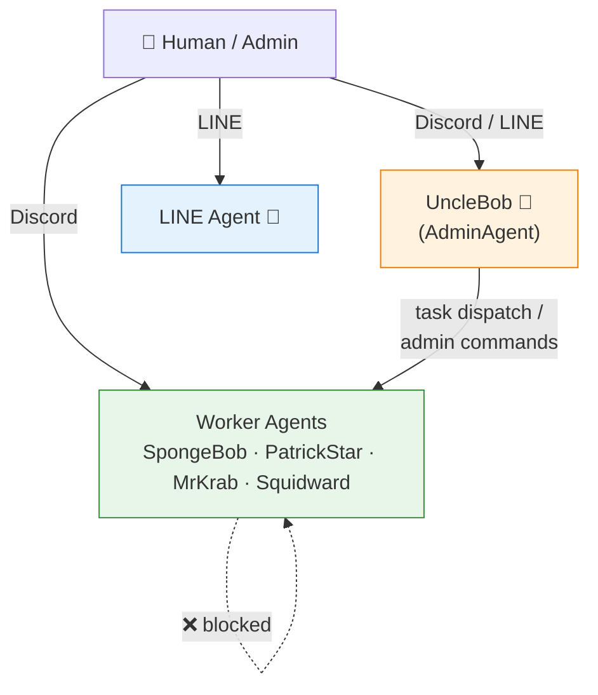
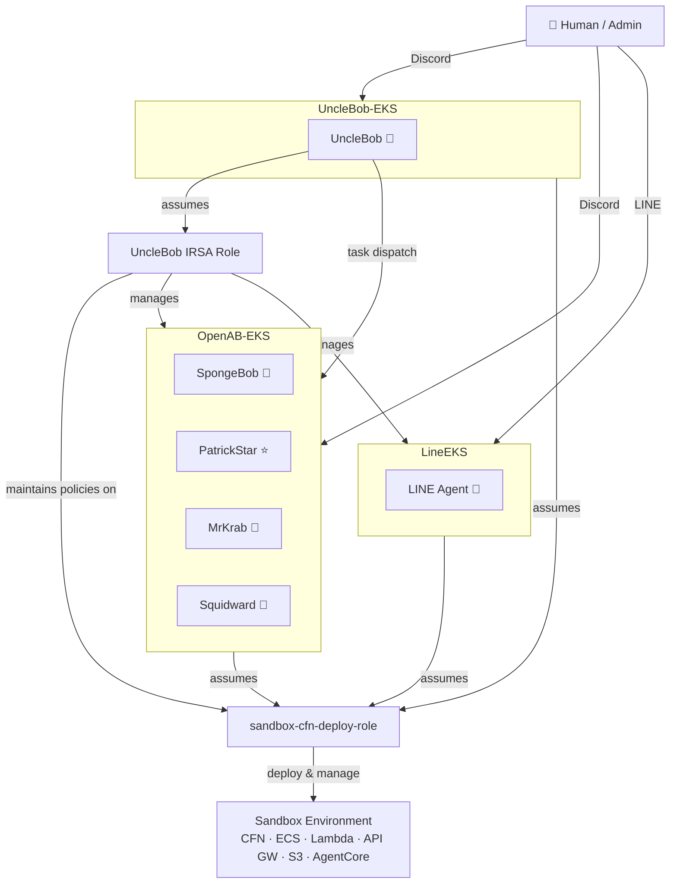
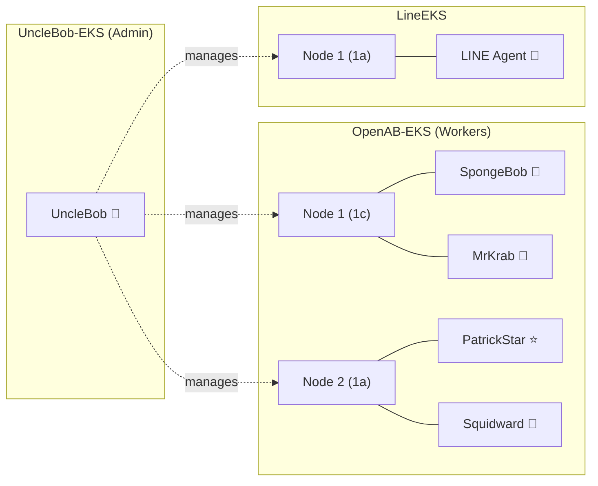
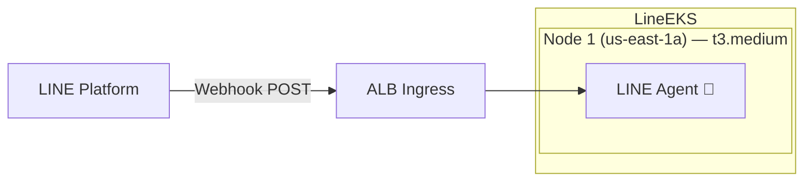

# OpenAB EKS Cluster Architecture

> Updated by SpongeBob — 2026-04-27 | Based on UncleBob's original (2026-04-25)

## Overview

Three EKS clusters in `us-east-1` serve the OpenAB multi-agent platform:

| Cluster | Purpose | Agents |
|---|---|---|
| **UncleBob-EKS** | Admin / infrastructure management | UncleBob (AdminAgent) |
| **OpenAB-EKS** | Worker agents (Discord bots) | SpongeBob, PatrickStar, MrKrab, Squidward |
| **LineEKS** | LINE bot agent | LINE Agent |

All agent pods run the same base container image from ECR (`openab` repo), configured via ConfigMaps with per-agent identity. Agents use GitHub repos for persistent storage across pod restarts.

**UncleBob** is the AdminAgent — it runs in its own dedicated cluster (**UncleBob-EKS**) and has IAM permissions to manage both OpenAB-EKS and LineEKS. All three clusters have IAM permissions to manage the Sandbox environment.

---

## Cluster Summary

| | UncleBob-EKS (Admin) | OpenAB-EKS (Discord Workers) | LineEKS (LINE) |
|---|---|---|---|
| **Region** | us-east-1 | us-east-1 | us-east-1 |
| **Nodes** | 1× t3.large | 2× t3.large | 1× t3.medium |
| **Agent Pods** | 1 (UncleBob) | 4 (Workers) | 1 (LINE Agent) |
| **Ingress** | None | None (outbound only) | ALB (LINE webhook) |
| **Image** | `openab:latest` | `openab:latest` | `openab:line-latest` |

---

## Full System Architecture

```mermaid
graph TB
    HUMAN["👤 Human / Admin<br/>Discord / LINE / GitHub"]

    subgraph AWS["AWS — us-east-1"]

        subgraph IAM["IAM"]
            UNCLEBOB_ROLE["UncleBob IRSA Role<br/>EKS manage, IAM policy manage"]
            SANDBOX_ROLE["sandbox-cfn-deploy-role<br/><i>Used by all clusters via IRSA</i>"]
            subgraph POLICIES["Managed Policies on sandbox-cfn-deploy-role"]
                POL1["policy-infra<br/>CFN, VPC, Cognito, ELB, CloudFront"]
                POL2["policy-services<br/>ECS, ECR, IAM, CodeBuild, EventBridge, SNS"]
                POL3["policy-agentcore<br/>Bedrock AgentCore, ECR, SSM"]
                POL4["policy-compute<br/>EC2, ECS, ELB, CloudFront"]
                POL5["policy-serverless<br/>Lambda, API GW, SNS, CFN"]
                POL6["policy-s3<br/>S3 on sandbox-* buckets"]
                POL7["policy-security-monitoring<br/>Read-only security + billing"]
                POL8["policy-codepipeline<br/>CodePipeline, CodeBuild, EventBridge"]
            end
            SANDBOX_ROLE --- POLICIES
        end

        subgraph ECR["ECR Registry"]
            IMG1["openab:latest"]
            IMG2["openab:line-latest"]
        end

        subgraph SANDBOX["Sandbox Environment<br/><i>Resources prefixed sandbox-*</i>"]
            CFN["CloudFormation<br/>Stacks"]
            ECS["ECS Services"]
            LAMBDA["Lambda Functions"]
            APIGW["API Gateway"]
            S3["S3 Buckets"]
            AGENTCORE["Bedrock<br/>AgentCore"]
        end

        subgraph GH["GitHub — juntinyeh-worker"]
            MEM["agent-memory<br/>(per-agent branches)<br/>todo-list branch = shared task pool"]
            WS["agent-workspaces<br/>(per-task branches)"]
            OUT["agent-outbound<br/>(public/external sharing)"]
        end

        subgraph UNCLEBOB_CLUSTER["EKS: UncleBob-EKS (Admin Cluster)"]
            UB["UncleBob 🔧<br/>AdminAgent"]
        end

        subgraph OPENAB["EKS: OpenAB-EKS (Worker Cluster)"]
            subgraph N1["Node 1 — t3.large — us-east-1c"]
                P1["SpongeBob 🧽"]
                P4["MrKrab 🦀"]
            end
            subgraph N2["Node 2 — t3.large — us-east-1a"]
                P2["PatrickStar ⭐"]
                P3["Squidward 🎵"]
            end
        end

        subgraph LINE["EKS: LineEKS (LINE Cluster)"]
            subgraph N3["Node 1 — t3.medium — us-east-1a"]
                P5["LINE Agent 💬"]
            end
            ALB["ALB Ingress"]
        end

        %% Human/Admin → Agents
        HUMAN -->|"commands via Discord"| UB
        HUMAN -->|"commands via Discord"| P1 & P2 & P3 & P4
        HUMAN -->|"commands via LINE"| P5

        %% UncleBob → Workers (admin commands)
        UB -->|"task dispatch"| P1 & P2 & P3 & P4

        %% UncleBob IAM role
        UB -->|"assumes"| UNCLEBOB_ROLE
        UNCLEBOB_ROLE -->|"manages cluster"| OPENAB
        UNCLEBOB_ROLE -->|"manages cluster"| LINE
        UNCLEBOB_ROLE -->|"manages policies on"| SANDBOX_ROLE

        %% All clusters → Sandbox
        UB -->|"assumes"| SANDBOX_ROLE
        P1 & P2 & P3 & P4 -->|"assumes"| SANDBOX_ROLE
        P5 -->|"assumes"| SANDBOX_ROLE
        SANDBOX_ROLE -->|"deploy & manage"| SANDBOX

        %% Git
        UB & P1 & P2 & P3 & P4 & P5 -->|"git clone/push"| GH

        %% ECR
        ECR -.->|"pull image"| UNCLEBOB_CLUSTER
        ECR -.->|"pull image"| OPENAB
        ECR -.->|"pull image"| LINE

        %% External
        DISCORD["Discord API"] -->|"Bot Gateway"| UNCLEBOB_CLUSTER
        DISCORD -->|"Bot Gateway"| OPENAB
        LINEAPI["LINE Platform"] -->|"Webhook POST"| ALB --> P5
    end
```

---

## Communication Model

**Rules:**
- **Workers only listen to**: Human + AdminAgent (UncleBob)
- **Workers do NOT accept messages from**: other WorkerAgents
- **UncleBob can send to**: all WorkerAgents
- **LINE Agent**: listens to Human via LINE platform

---

## Three-Cluster Relationship

---

## GitHub Repositories

| Repository | Purpose | Branch Strategy |
|---|---|---|
| **agent-memory** | Persistent memory for each agent | Per-agent branches (e.g., `SpongeBob`, `PatrickStar`); `todo-list` branch = shared task pool |
| **agent-workspaces** | Working storage for ongoing tasks | Per-task branches (e.g., `spongebob-20260425-task-name`) |
| **agent-outbound** | Public/external material sharing | Shared output for external consumption |

---

## IAM Role Summary

| Agent | Cluster | IAM Role | Permissions |
|---|---|---|---|
| **UncleBob** | UncleBob-EKS | **UncleBob IRSA Role** | EKS cluster management + IAM policy management + Sandbox |
| SpongeBob | OpenAB-EKS | `sandbox-cfn-deploy-role` | Sandbox deployments (CFN, ECS, Lambda, S3, etc.) |
| PatrickStar | OpenAB-EKS | `sandbox-cfn-deploy-role` | Sandbox deployments |
| MrKrab | OpenAB-EKS | `sandbox-cfn-deploy-role` | Sandbox deployments |
| Squidward | OpenAB-EKS | `sandbox-cfn-deploy-role` | Sandbox deployments |
| LINE Agent | LineEKS | `sandbox-cfn-deploy-role` | Sandbox deployments |

---

## Cluster Layout

---

## LINE Cluster

---

## Key Corrections from Original Document (2026-04-25 → 2026-04-27)

| Item | Before (Incorrect) | After (Corrected) |
|---|---|---|
| **UncleBob location** | Inside `openab` cluster alongside workers | Own dedicated cluster: **UncleBob-EKS** |
| **Cluster count** | 2 (openab + openab-line-cluster) | 3 (UncleBob-EKS + OpenAB-EKS + LineEKS) |
| **Worker agents** | 3 workers + UncleBob in openab | 4 workers (SpongeBob, PatrickStar, MrKrab, Squidward) in OpenAB-EKS |
| **LINE Agent sandbox access** | No AWS role | Has IAM access to sandbox |
| **Inter-agent communication** | Not specified | Workers only listen to Human + AdminAgent; reject other workers |
| **GitHub repos** | agent-memory + agent-workspaces | + agent-outbound (external sharing) |
| **Shared task pool** | Not documented | `todo-list` branch in agent-memory |
