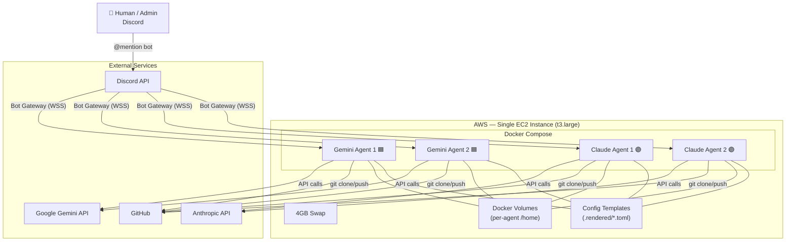
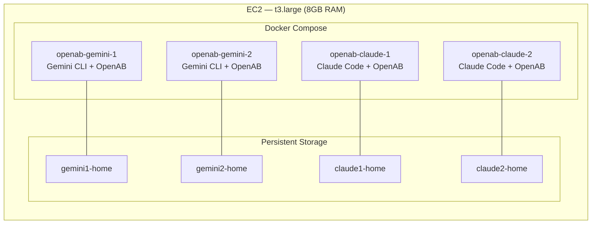
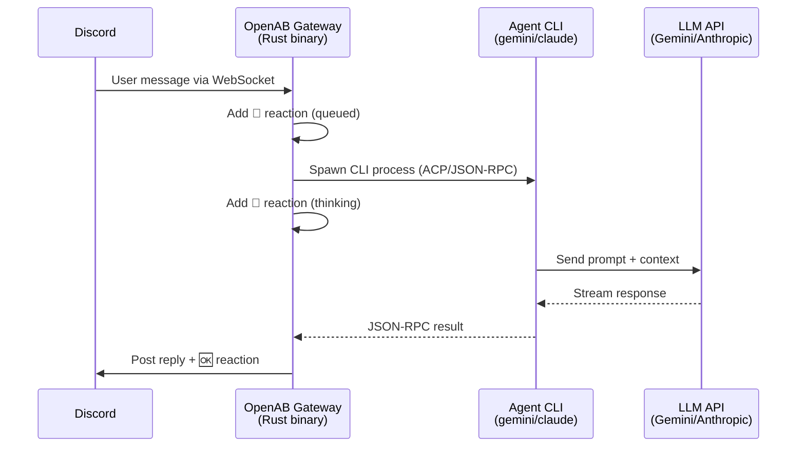
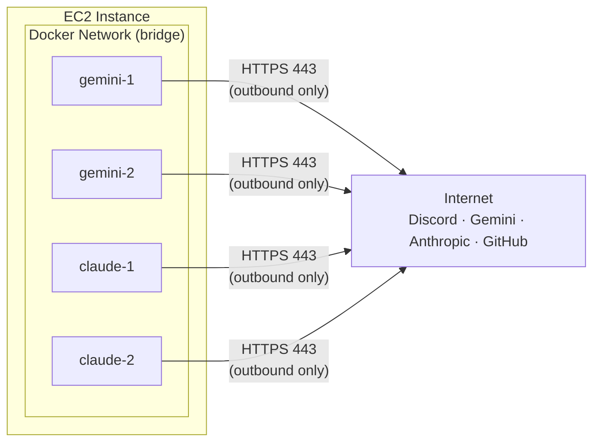
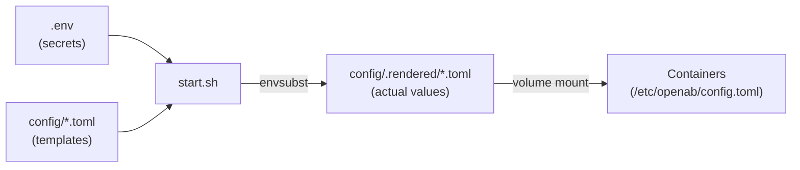
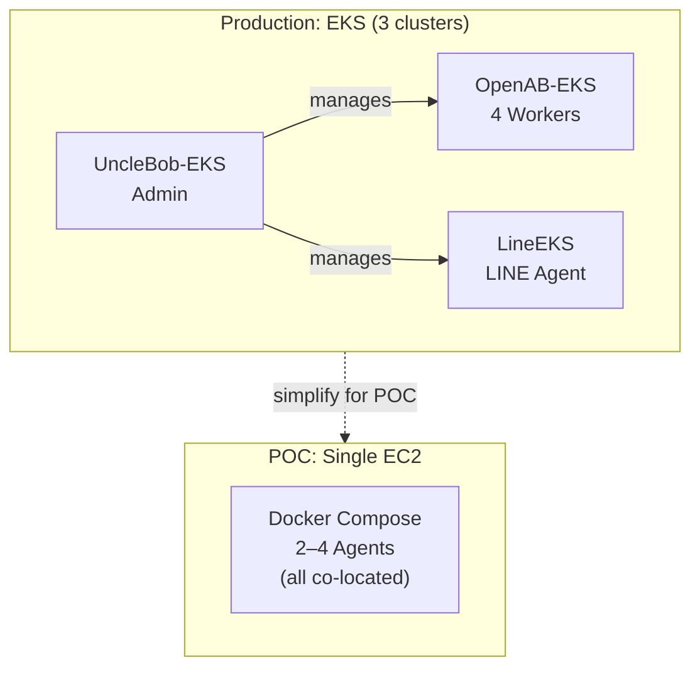

# OpenAB EC2 Docker Compose Architecture

> For early-stage POC / demo — single EC2, no Kubernetes required

## Overview

A lightweight alternative to the full EKS cluster deployment. All agents run as Docker containers on a single EC2 instance, orchestrated by Docker Compose. Ideal for:

- Quick demos and proof-of-concept
- Cost-sensitive environments
- Teams evaluating OpenAB before committing to Kubernetes
- Development and testing

---

## Architecture Comparison

| | EKS Cluster (Production) | EC2 Docker Compose (POC) |
|---|---|---|
| **Infrastructure** | 3 EKS clusters, multiple nodes | 1 EC2 instance |
| **Orchestration** | Kubernetes + Helm | Docker Compose |
| **Scaling** | Horizontal (add nodes/pods) | Vertical (resize instance) |
| **HA / Failover** | Multi-AZ, pod rescheduling | None (single instance) |
| **Cost** | ~$200+/month (EKS + nodes) | ~$60/month (t3.large) |
| **Setup time** | ~30 min (EKS + Helm) | ~10 min (one-liner) |
| **IAM integration** | IRSA per pod | Shared instance role or env vars |
| **Image source** | ECR (private registry) | Built from source on instance |

---

## System Architecture



---

## Container Layout



---

## Deployment Scenarios

Three pre-built compose files for different demo needs:

| Scenario | Command | Containers | Images | Instance |
|----------|---------|-----------|--------|----------|
| **A** — Mixed | `./start.sh` | 2× Gemini + 2× Claude | 2 | t3.large |
| **B** — Gemini only | `./start.sh gemini3` | 3× Gemini | 1 | t3.medium |
| **C** — Claude only | `./start.sh claude2` | 2× Claude | 1 | t3.medium |

---

## How Each Container Works



Each container runs:
1. **OpenAB** (Rust) — Discord bot gateway, session pool, reaction management
2. **Agent CLI** (spawned per message) — the actual AI agent (Gemini or Claude Code)

---

## Networking



- **No inbound ports required** — all connections are outbound WebSocket/HTTPS
- Containers share Docker's default bridge network
- Each container has its own Discord bot token → independent WebSocket connection
- Security group: only outbound 443 needed

---

## Configuration Flow



1. Secrets live in `.env` (never committed)
2. Config templates use `${VAR}` placeholders
3. `start.sh` renders templates with actual values via `envsubst`
4. Rendered configs are mounted read-only into containers

---

## Resource Allocation

| Component | RAM Usage (approx) |
|-----------|-------------------|
| Docker engine | ~200MB |
| OpenAB process (per container) | ~30MB |
| Agent CLI active session | ~200–500MB |
| Idle container | ~50MB |
| **Total (4 agents, 2 active)** | **~2–3GB** |

With 8GB RAM + 4GB swap on a t3.large, this leaves comfortable headroom for concurrent agent activity.

---

## Comparison with EKS Deployment



### When to Graduate to EKS

| Signal | Action |
|--------|--------|
| Need HA / zero-downtime | Move to EKS |
| >4 agents | Move to EKS (or larger instance) |
| Need per-agent IAM roles | Move to EKS (IRSA) |
| Multi-team / multi-tenant | Move to EKS |
| Demo / single-team / cost-sensitive | Stay on EC2 |

---

## Limitations (vs EKS)

- **No auto-restart on instance failure** — use ASG with min=max=1 for self-healing
- **No horizontal scaling** — all agents share one instance's resources
- **No per-agent IAM** — all containers share the instance's IAM role
- **No rolling updates** — `docker compose pull && ./start.sh` causes brief downtime
- **Single AZ** — instance failure = all agents offline

---

## Quick Reference

```bash
# Install (fresh EC2)
curl -fsSL https://raw.githubusercontent.com/juntinyeh-worker/agent-outbound/main/openab-ec2-demo/install.sh | bash

# Configure
cd ~/openab-demo && vim .env

# Launch scenarios
./start.sh              # 2x Gemini + 2x Claude
./start.sh gemini3      # 3x Gemini
./start.sh claude2      # 2x Claude

# Operations
docker compose ps
docker compose logs -f
docker compose down
```
