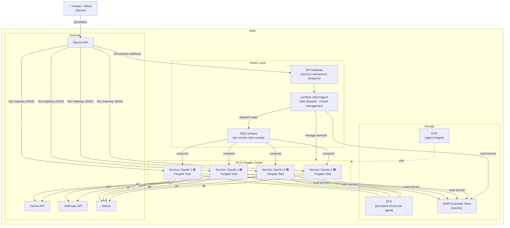
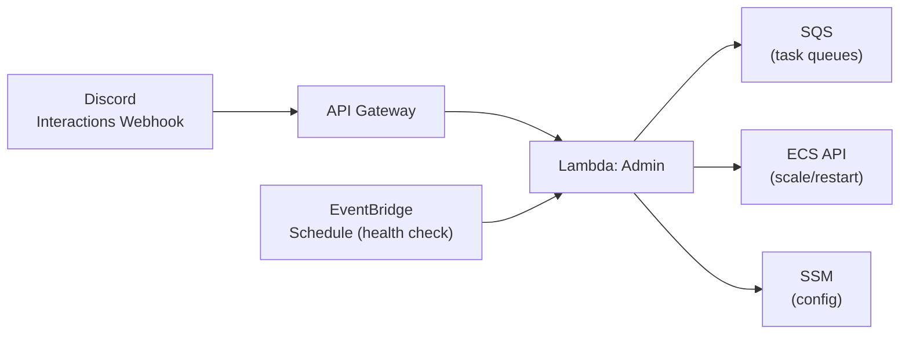
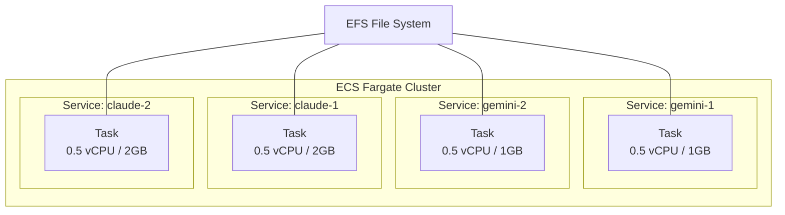
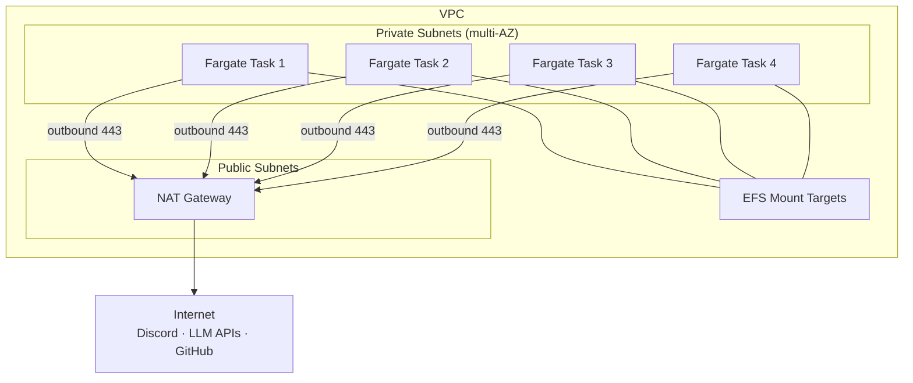
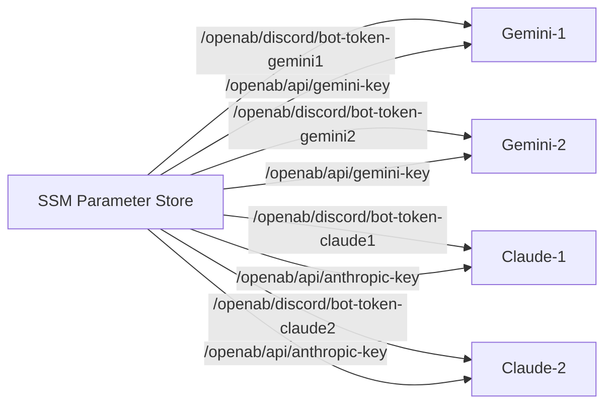
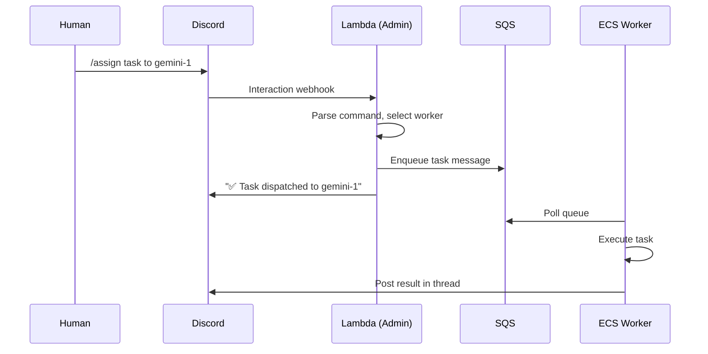

# OpenAB ECS Fargate + Lambda Architecture

> Serverless-first deployment — Admin on Lambda, Workers on ECS Fargate

## Overview

A middle-ground architecture between the single-EC2 POC and the full EKS production setup. The Admin agent runs as an event-driven Lambda function, while worker agents run as long-lived ECS Fargate services. No cluster management, no EC2 instances to maintain.

---

## Architecture Comparison

| | EC2 Docker Compose (POC) | ECS Fargate + Lambda | EKS (Production) |
|---|---|---|---|
| **Admin agent** | Same container | Lambda (event-driven) | Dedicated EKS cluster |
| **Worker agents** | Docker containers | ECS Fargate services | EKS pods |
| **Infra management** | Manual | Managed (no servers) | eksctl / Helm |
| **Scaling** | Vertical (resize EC2) | Per-service (Fargate tasks) | Horizontal (nodes + pods) |
| **Cost (idle)** | ~$60/month (always on) | ~$30–50/month (Fargate only) | ~$200+/month |
| **Cost (active)** | Same | Pay-per-use Lambda + Fargate | Same |
| **HA** | None | Multi-AZ (Fargate) | Multi-AZ (EKS) |
| **Setup complexity** | Low | Medium | High |

---

## System Architecture



---

## Component Breakdown

### Admin Agent (Lambda)

| Aspect | Detail |
|--------|--------|
| **Runtime** | Lambda (Node.js or custom runtime) |
| **Trigger** | API Gateway (Discord Interactions endpoint) + EventBridge (scheduled) |
| **Responsibilities** | Task dispatch, worker health checks, scaling decisions |
| **State** | Stateless — reads/writes to DynamoDB or GitHub |
| **Timeout** | 15 min max (sufficient for dispatch, not for long tasks) |
| **Cost** | Near-zero when idle (pay per invocation) |



**Why Lambda for Admin:**
- Admin tasks are short-lived (dispatch a task, check health, scale a service)
- No need to keep a process running 24/7 just for occasional admin commands
- Cost: ~$0/month for typical admin usage (few hundred invocations)

### Worker Agents (ECS Fargate)

| Aspect | Detail |
|--------|--------|
| **Runtime** | ECS Fargate (long-running service) |
| **Image** | Same `openab-gemini` / `openab-claude` from ECR |
| **Networking** | awsvpc mode, outbound-only (NAT Gateway or VPC endpoints) |
| **Storage** | EFS mount for persistent `/home` |
| **Secrets** | SSM Parameter Store → injected as env vars |
| **Scaling** | Desired count per service (1 task = 1 agent) |



---

## Networking



- **No inbound ports** — agents connect outbound to Discord WebSocket
- **Private subnets** — tasks not directly internet-accessible
- **NAT Gateway** — provides outbound internet access
- **EFS** — mounted in same AZs as Fargate tasks

---

## Secrets Management



Secrets stored in SSM Parameter Store (SecureString), injected into task definitions as environment variables. No `.env` files on disk.

---

## Task Definition (Example)

```json
{
  "family": "openab-gemini",
  "cpu": "512",
  "memory": "1024",
  "networkMode": "awsvpc",
  "containerDefinitions": [{
    "name": "openab-gemini",
    "image": "<account>.dkr.ecr.<region>.amazonaws.com/openab-gemini:latest",
    "essential": true,
    "command": ["openab", "run", "-c", "/etc/openab/config.toml"],
    "secrets": [
      {"name": "DISCORD_BOT_TOKEN", "valueFrom": "/openab/discord/bot-token-gemini1"},
      {"name": "GEMINI_API_KEY", "valueFrom": "/openab/api/gemini-key"},
      {"name": "GH_TOKEN", "valueFrom": "/openab/github/pat"}
    ],
    "mountPoints": [{
      "sourceVolume": "agent-home",
      "containerPath": "/home/node"
    }],
    "logConfiguration": {
      "logDriver": "awslogs",
      "options": {
        "awslogs-group": "/ecs/openab-gemini-1",
        "awslogs-region": "<region>",
        "awslogs-stream-prefix": "ecs"
      }
    }
  }],
  "volumes": [{
    "name": "agent-home",
    "efsVolumeConfiguration": {
      "fileSystemId": "fs-xxxxxxxx",
      "rootDirectory": "/gemini1"
    }
  }]
}
```

---

## Cost Estimate (4 agents)

| Component | Monthly Cost |
|-----------|-------------|
| Fargate (4 tasks × 0.5 vCPU × 1–2GB, 24/7) | ~$40–60 |
| EFS (5GB, infrequent access) | ~$1 |
| NAT Gateway (outbound traffic) | ~$5–10 |
| Lambda (Admin, <1000 invocations) | ~$0 |
| SSM Parameter Store | ~$0 |
| ECR (image storage) | ~$1 |
| CloudWatch Logs | ~$2 |
| **Total** | **~$50–75/month** |

---

## Admin Lambda: Task Dispatch Flow



---

## Scaling Model

| Action | How |
|--------|-----|
| Add a worker | New ECS service + task definition |
| Remove a worker | Set desired count = 0 |
| Pause all workers | `aws ecs update-service --desired-count 0` |
| Resume | `aws ecs update-service --desired-count 1` |
| Scale a worker (more resources) | Update task definition CPU/memory |

The Admin Lambda can automate these via the ECS API — e.g., scale down workers at night, scale up on demand.

---

## vs EKS: When to Use This

| Choose ECS Fargate + Lambda when... | Choose EKS when... |
|---|---|
| Team doesn't know Kubernetes | Team already uses K8s |
| Want zero server management | Need custom scheduling/operators |
| 2–6 agents | 10+ agents |
| Cost-sensitive | Need advanced networking (service mesh) |
| Simple scaling (per-service) | Complex multi-tenant isolation |

---

## Migration Path

```
EC2 Docker Compose (POC)
        ↓ ready for production
ECS Fargate + Lambda (Serverless)
        ↓ outgrow Fargate limits
EKS (Full Kubernetes)
```

The same Docker images work across all three. The main changes are:
- **EC2 → ECS**: Move `.env` to SSM, Docker volumes to EFS, compose to task definitions
- **ECS → EKS**: Task definitions become pod specs, EFS stays, add Helm chart
