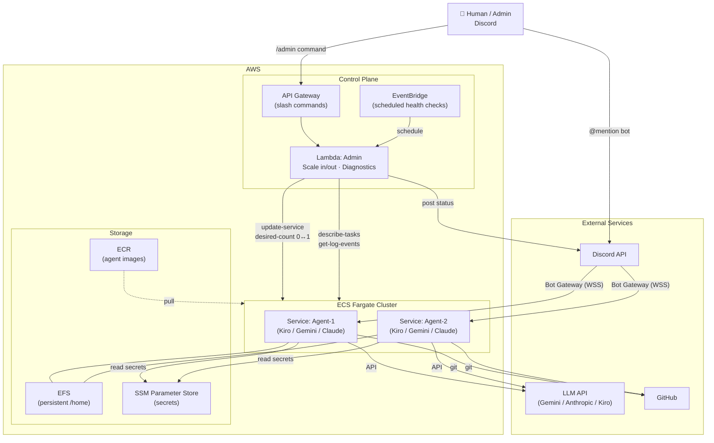
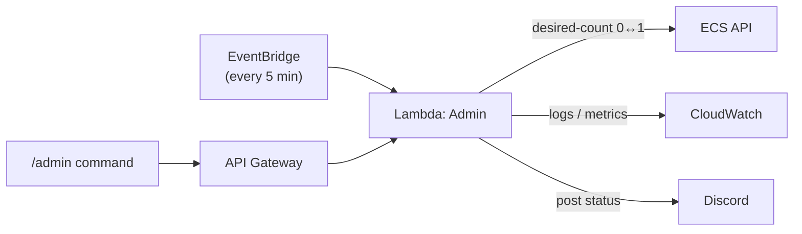
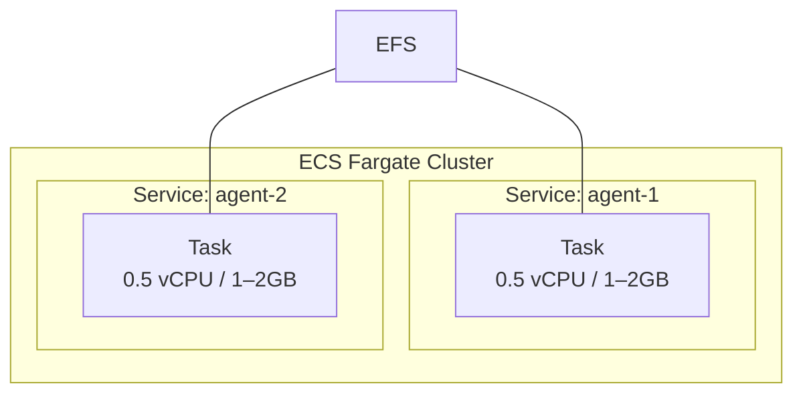
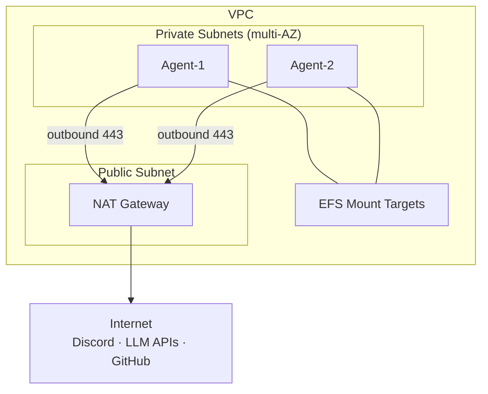
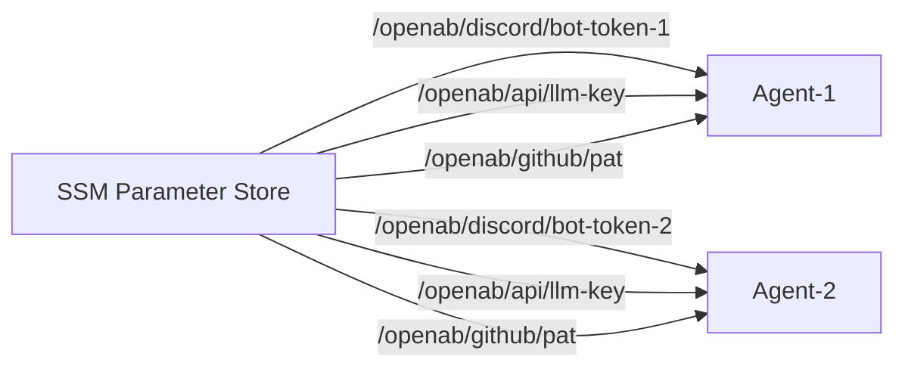
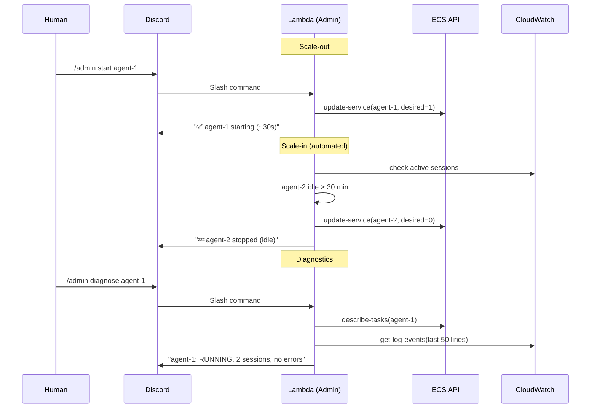

# OpenAB ECS Fargate + Lambda Architecture

> Serverless-first deployment — Admin on Lambda, 2 Workers on ECS Fargate

## Overview

A lightweight serverless architecture: Admin runs as a Lambda function (control plane), worker agents run as ECS Fargate services (data plane). No servers to manage, pay only for what you use.

---

## Architecture Comparison

| | EC2 Docker Compose (POC) | ECS Fargate + Lambda | EKS (Production) |
|---|---|---|---|
| **Admin** | Same container | Lambda (event-driven) | Dedicated EKS cluster |
| **Workers** | Docker containers | ECS Fargate services | EKS pods |
| **Infra management** | Manual | Managed (no servers) | eksctl / Helm |
| **Scaling** | Vertical | Per-service (desired 0↔1) | Horizontal |
| **Cost (idle)** | ~$60/month | ~$15–30/month | ~$200+/month |
| **HA** | None | Multi-AZ (Fargate) | Multi-AZ (EKS) |

---

## System Architecture



---

## Component Breakdown

### Admin (Lambda) — Control Plane

The Admin Lambda is **not** a conversational agent. It manages the worker fleet.

| Aspect | Detail |
|--------|--------|
| **Runtime** | Lambda (Python or Node.js) |
| **Trigger** | EventBridge (scheduled) + API Gateway (Discord slash commands) |
| **Responsibilities** | Scale workers in/out, health checks, diagnostics |
| **Cost** | ~$0/month (pay per invocation) |



**What it does:**

| Action | Trigger | API Call |
|--------|---------|---------|
| Start a worker | `/admin start agent-1` | `update-service --desired-count 1` |
| Stop idle worker | Scheduled (idle > 30 min) | `update-service --desired-count 0` |
| Diagnose | `/admin diagnose agent-1` | `describe-tasks` + `get-log-events` |
| Health check | Scheduled (every 5 min) | `describe-services`, restart unhealthy |

### Workers (ECS Fargate) — Data Plane

Each worker is an ECS service running one Fargate task. Pick any agent CLI per service.

| Aspect | Detail |
|--------|--------|
| **Image options** | `openab` (Kiro), `openab-gemini`, `openab-claude` |
| **Networking** | awsvpc, outbound-only via NAT Gateway |
| **Storage** | EFS mount at `/home/node` or `/home/agent` |
| **Secrets** | SSM → injected as env vars |
| **Scaling** | Binary: desired-count 0 (off) or 1 (on) |



---

## Networking



- No inbound ports — agents connect outbound to Discord WebSocket
- Private subnets — not directly internet-accessible
- NAT Gateway — outbound internet access

---

## Secrets Management



---

## Task Definition (Example)

```json
{
  "family": "openab-agent",
  "cpu": "512",
  "memory": "1024",
  "networkMode": "awsvpc",
  "containerDefinitions": [{
    "name": "openab",
    "image": "<account>.dkr.ecr.<region>.amazonaws.com/openab-gemini:latest",
    "command": ["openab", "run", "-c", "/etc/openab/config.toml"],
    "secrets": [
      {"name": "DISCORD_BOT_TOKEN", "valueFrom": "/openab/discord/bot-token-1"},
      {"name": "GEMINI_API_KEY", "valueFrom": "/openab/api/gemini-key"},
      {"name": "GH_TOKEN", "valueFrom": "/openab/github/pat"}
    ],
    "mountPoints": [{"sourceVolume": "home", "containerPath": "/home/node"}],
    "logConfiguration": {
      "logDriver": "awslogs",
      "options": {
        "awslogs-group": "/ecs/openab-agent-1",
        "awslogs-region": "<region>",
        "awslogs-stream-prefix": "ecs"
      }
    }
  }],
  "volumes": [{
    "name": "home",
    "efsVolumeConfiguration": {
      "fileSystemId": "fs-xxxxxxxx",
      "rootDirectory": "/agent1"
    }
  }]
}
```

---

## Operations Flow



---

## Scaling Model

| State | Desired Count | Cost | Response Time |
|-------|--------------|------|---------------|
| **Running** | 1 | Fargate charges | Instant |
| **Stopped** | 0 | $0 | ~30s cold start |

**Commands:**

| Command | Effect |
|---------|--------|
| `/admin start agent-1` | desired-count = 1 |
| `/admin stop agent-2` | desired-count = 0 |
| `/admin stop-all` | All → 0 |
| `/admin start-all` | All → 1 |
| `/admin status` | Show running/stopped state |
| `/admin diagnose agent-1` | Task status + recent logs |

**Auto scale-in:** EventBridge → Lambda every 5 min. If idle > 30 min → stop.

---

## Cost Estimate (2 agents)

| Component | Monthly Cost |
|-----------|-------------|
| Fargate (2 tasks × 0.5 vCPU × 1GB, 24/7) | ~$15–25 |
| EFS (2GB) | ~$0.50 |
| NAT Gateway | ~$5 |
| Lambda (<1000 invocations) | ~$0 |
| SSM / ECR / CloudWatch | ~$2 |
| **Total** | **~$25–35/month** |

With auto scale-in (agents stopped at night): **~$15–20/month**.

---

## Agent Flexibility

Each ECS service independently chooses its agent CLI:

| Service | Image | Agent CLI | Use Case |
|---------|-------|-----------|----------|
| agent-1 | `openab` | kiro-cli | AWS-focused tasks |
| agent-1 | `openab-gemini` | gemini | General coding |
| agent-1 | `openab-claude` | claude-code | Complex reasoning |

Mix and match — just change the image in the task definition.

---

## Migration Path

```
EC2 Docker Compose (POC)     →  same images, move .env to SSM, volumes to EFS
        ↓
ECS Fargate + Lambda         →  task definitions become pod specs
        ↓
EKS (Full Kubernetes)
```
