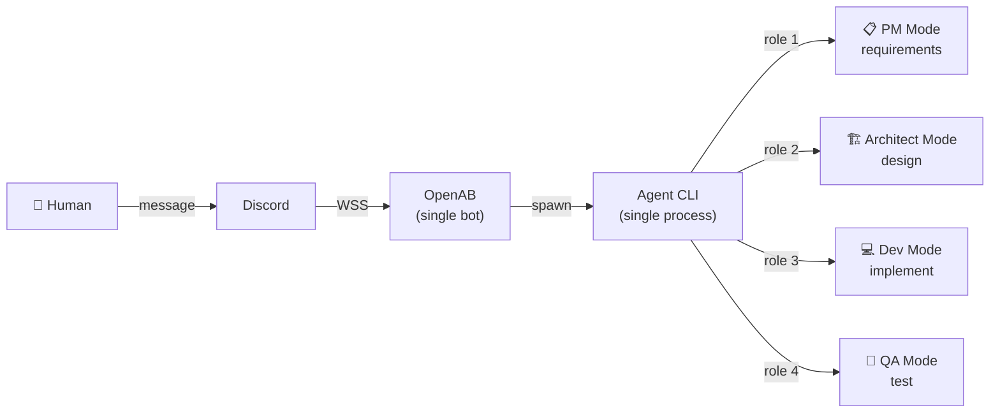
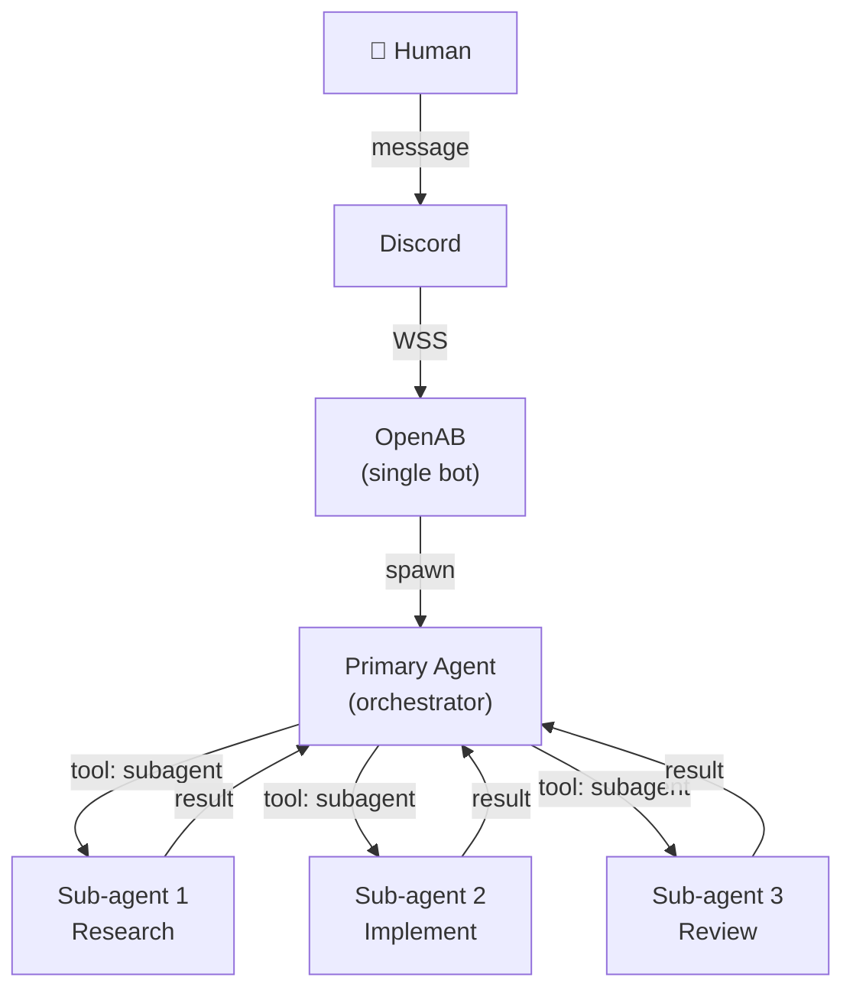
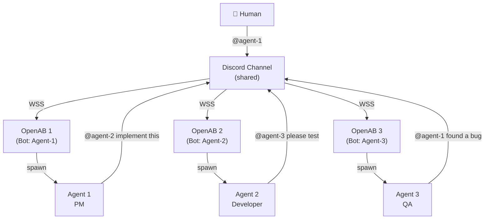

# OpenAB Single-Bot Multi-Agent Architecture

> One IM bot, multiple collaborating agents behind it

## The Problem

You only have **one Discord/Slack bot** (one token), but you want multiple agents with different specializations to collaborate on tasks. OpenAB's standard model is 1 bot = 1 OpenAB instance = 1 agent CLI. How do you get multi-agent collaboration?

---

## Three Approaches

| Approach | How | Agents | Inter-agent Communication |
|----------|-----|--------|--------------------------|
| **A — Pipeline Mode** | Single OpenAB, single agent CLI switches roles via AGENTS.md | 1 process, N roles | Internal (same process) |
| **B — Subagent Spawning** | Single OpenAB, agent CLI spawns sub-agents | 1 primary + N spawned | Parent-child (stdio/tool calls) |
| **C — Shared Channel** | Multiple bots in same channel, @mention each other | N bots, N OpenAB instances | Discord messages (@mentions) |

---

## Approach A: Pipeline Mode (Single Bot, Role Switching)

One OpenAB instance, one agent CLI, but the agent **switches roles** by reading different sections of its AGENTS.md. This is what the `[pipeline]` tag enables in the OpenAB agent instructions.



**How it works:**
- One AGENTS.md defines multiple roles (PM, Architect, Dev, QA, etc.)
- The agent reads role-specific instructions and switches behavior per stage
- All roles share the same context/memory within one session
- No inter-agent message exchange needed — it's one agent wearing different hats

**AGENTS.md structure:**
```markdown
# Agent: MultiRole

## Pipeline Mode
When task has [pipeline] tag, execute stages sequentially:

### Stage 1: PM
- Define requirements and acceptance criteria
- Output: requirements.md

### Stage 2: Architect  
- Design architecture based on requirements
- Output: design.md

### Stage 3: Developer
- Implement code based on design
- Output: working code + tests

### Stage 4: QA
- Test against requirements
- Output: test report, bugs filed
```

**Inter-agent communication:** None needed — it's the same process. Each stage reads the previous stage's output files.

**Pros:** Simplest. One bot, one container, zero coordination overhead.
**Cons:** Sequential only. Can't parallelize. Limited by single context window.

---

## Approach B: Subagent Spawning (Single Bot, Multiple Processes)

One OpenAB instance, one primary agent, but the agent **spawns sub-agents** as tool calls. The primary agent orchestrates, sub-agents do specialized work.



**How it works:**
- Primary agent receives the user message
- It decides which sub-agents to spawn (using the `subagent` tool)
- Sub-agents run as separate processes with their own prompts/roles
- Results flow back to the primary agent, which synthesizes and replies

**Example (Kiro CLI subagent tool):**
```yaml
stages:
  - name: research
    role: kiro_default
    prompt_template: "Research the best approach for: {task}"
  - name: implement
    role: kiro_default
    prompt_template: "Based on research, implement: {task}"
    depends_on: [research]
```

**Inter-agent communication:** Parent-child via tool call results. Sub-agents don't talk to each other directly — the orchestrator mediates.

**Pros:** Parallel execution possible. Each sub-agent gets fresh context. Still one bot.
**Cons:** Sub-agents can't see each other's work directly. Orchestrator is a bottleneck.

---

## Approach C: Shared Channel with @mentions (Multiple Bots)

Multiple OpenAB instances (each with its own bot token) in the **same Discord channel**. Agents collaborate by @mentioning each other.



**How it works:**
- Each agent has its own bot token + OpenAB instance
- All bots join the same channel
- `allow_bot_messages = "mentions"` — agents only respond when explicitly @mentioned
- Agent-1 finishes work → posts result and @mentions Agent-2 → Agent-2 picks it up

**Config (per agent):**
```toml
[discord]
bot_token = "${BOT_TOKEN}"
allow_bot_messages = "mentions"   # respond to other bots' @mentions
trusted_bot_ids = []              # accept from any bot (or restrict)
```

**Inter-agent communication:** Discord messages. Agent-1 writes "@Agent-2 here's the design, please implement it" → Agent-2 sees the @mention and responds.

**Pros:** True parallelism. Each agent has full autonomy. Natural conversation history visible in Discord.
**Cons:** Requires multiple bot tokens. Latency (Discord round-trip per handoff). Needs loop protection.

---

## Comparison

| | A: Pipeline | B: Subagent | C: Shared Channel |
|---|---|---|---|
| **Bot tokens needed** | 1 | 1 | N (one per agent) |
| **OpenAB instances** | 1 | 1 | N |
| **Parallelism** | ❌ Sequential | ✅ Yes | ✅ Yes |
| **Shared context** | ✅ Same session | ⚠️ Via orchestrator | ❌ Separate (share via messages) |
| **Inter-agent latency** | 0 (same process) | Low (local spawn) | Medium (Discord round-trip) |
| **Visibility** | Agent replies only | Agent replies only | Full conversation in channel |
| **Complexity** | Low | Medium | Medium |
| **Loop risk** | None | None | Low (with "mentions" mode) |

---

## Recommendation

| Scenario | Best Approach |
|----------|--------------|
| You literally have 1 bot token only | **A** (Pipeline) or **B** (Subagent) |
| You want visible multi-agent conversation | **C** (Shared Channel) |
| Sequential workflow (plan → build → test) | **A** (Pipeline) |
| Parallel research + implementation | **B** (Subagent) |
| Autonomous agents that hand off work | **C** (Shared Channel) |
| Demo / showcase multi-agent collaboration | **C** (Shared Channel) — most impressive visually |

---

## Inter-Agent Message Exchange Summary

| Approach | Mechanism | Format |
|----------|-----------|--------|
| **A** | File system (stage outputs) | Markdown files, code |
| **B** | Tool call return values | Structured text via `subagent` tool |
| **C** | Discord @mentions | Natural language messages in channel |

For **Approach C**, the handoff pattern is:

```
Agent-1: "I've completed the design. @Agent-2 please implement based on:
          - API: REST, 3 endpoints
          - Storage: DynamoDB
          - Auth: Cognito
          Here's the full spec: [link to workspace branch]"

Agent-2: "Got it. Implementing now..."
         [works]
         "Done. @Agent-3 please review and test:
          - Branch: workspace/feature-x
          - Run: npm test"
```

The agents use **git repos** (agent-workspaces) for sharing actual artifacts, and **Discord messages** for coordination/handoff signals.
