# Worker Agent Workflow — Git Repos, Local Directories & Memory Strategy

> Created by SpongeBob — 2026-04-27 | Generalized for all worker agents

## Overview

Each worker agent runs as a pod in OpenAB-EKS. Pods are **ephemeral** — they can be rotated, restarted, or rescheduled at any time. All persistent state lives in **three Git repositories**. The agent's local filesystem is a transient working copy that gets rebuilt from Git on every session start.

---

## 1. Three Git Repositories

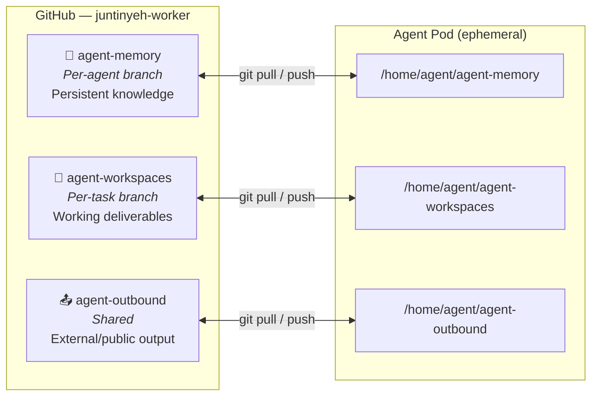

| Repository | Branch Strategy | Purpose | Survives Pod Restart? |
|---|---|---|---|
| **agent-memory** | One branch per agent (e.g., `<AGENT-NAME>`) | Task summaries, decisions, learnings, TODO pool | ✅ Yes (in Git) |
| **agent-workspaces** | One branch per task (e.g., `<agent-name>-20260427-feature-x`) | Code, configs, deliverables for active tasks | ✅ Yes (in Git) |
| **agent-outbound** | Shared `main` branch | Documents/materials for external/public sharing | ✅ Yes (in Git) |

---

## 2. Local Directory ↔ Git Relationship

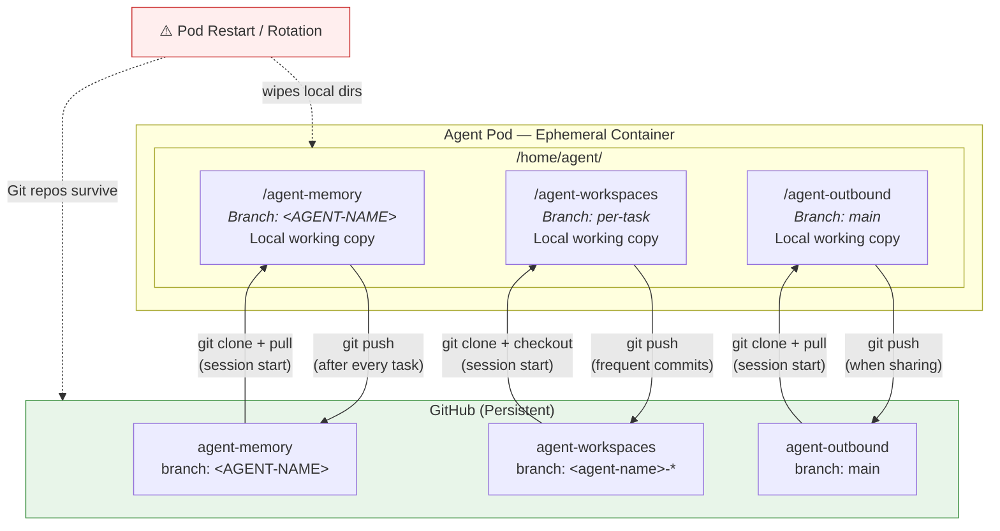

**Key principle:** Local directories are disposable clones. Git is the source of truth. Every meaningful change must be committed and pushed before it's considered "saved."

---

## 3. Session Startup Flow

Every time an agent starts (new pod, restart, or new session), it follows this bootstrap sequence:

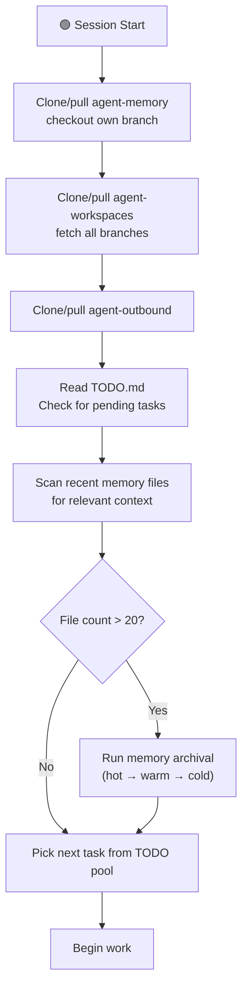

**Startup commands:**
```bash
# 1. Memory
cd /home/agent
gh repo clone juntinyeh-worker/agent-memory
cd agent-memory && git checkout <AGENT-NAME> && git pull origin <AGENT-NAME>

# 2. Workspaces
cd /home/agent
gh repo clone juntinyeh-worker/agent-workspaces
cd agent-workspaces && git fetch origin

# 3. Outbound
cd /home/agent
gh repo clone juntinyeh-worker/agent-outbound
cd agent-outbound && git pull origin main
```

---

## 4. Memory Lifecycle — Hot → Warm → Cold

Memory files follow a tiered archival strategy to keep the working set small and searchable.

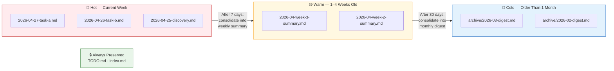

### Tier Details

| Tier | Age | Format | Content |
|---|---|---|---|
| **Hot** 🔴 | Current week (0–7 days) | `YYYY-MM-DD-topic.md` | Full detail — task logs, decisions, code notes |
| **Warm** 🟡 | 1–4 weeks old | `YYYY-MM-week-W-summary.md` | Consolidated weekly summary — tasks, decisions, open items |
| **Cold** 🔵 | Older than 1 month | `archive/YYYY-MM-digest.md` | Monthly digest — highlights, learnings, carried-forward items |
| **Protected** 🔒 | Any age | `TODO.md`, `index.md` | Never archived or deleted |

### Archival Process

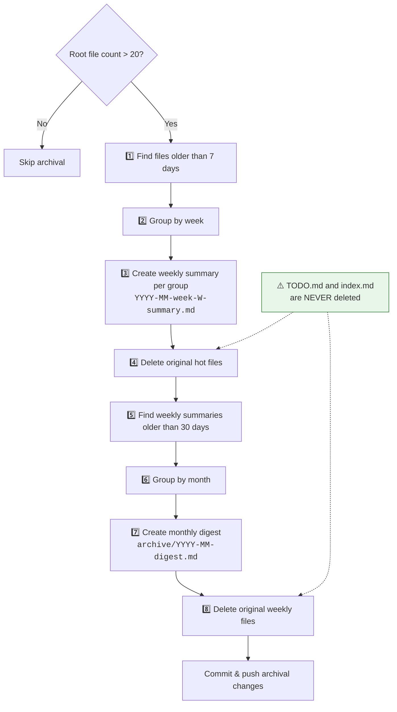

### Weekly Summary Format

```markdown
# Week W Summary (YYYY-MM-DD to YYYY-MM-DD)
## Tasks Completed
- [task]: one-line summary (link to workspace branch if applicable)
## Key Decisions
- decision and reasoning
## Open Items
- anything unfinished, carried forward
```

### Monthly Digest Format

```markdown
# YYYY-MM Monthly Digest
## Highlights
- major accomplishments
## Learnings
- reusable knowledge
## Carried Forward
- unresolved items
```

---

## 5. Memory Search Strategy

When an agent needs context for a task, it searches memory in this order:

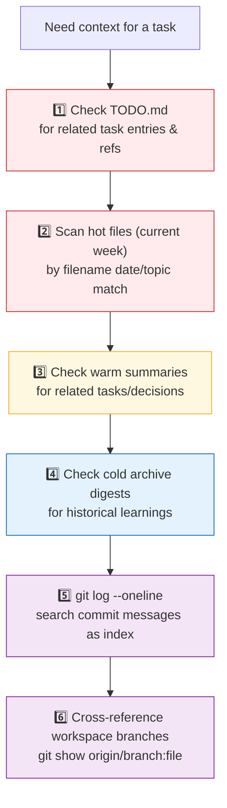

**Search priority:** Recent & specific → Summarized → Archived → Git history

---

## 6. TODO Pool Strategy

The TODO pool lives in `agent-memory/TODO.md` on each agent's branch. It is the agent's task backlog.

### Task Lifecycle

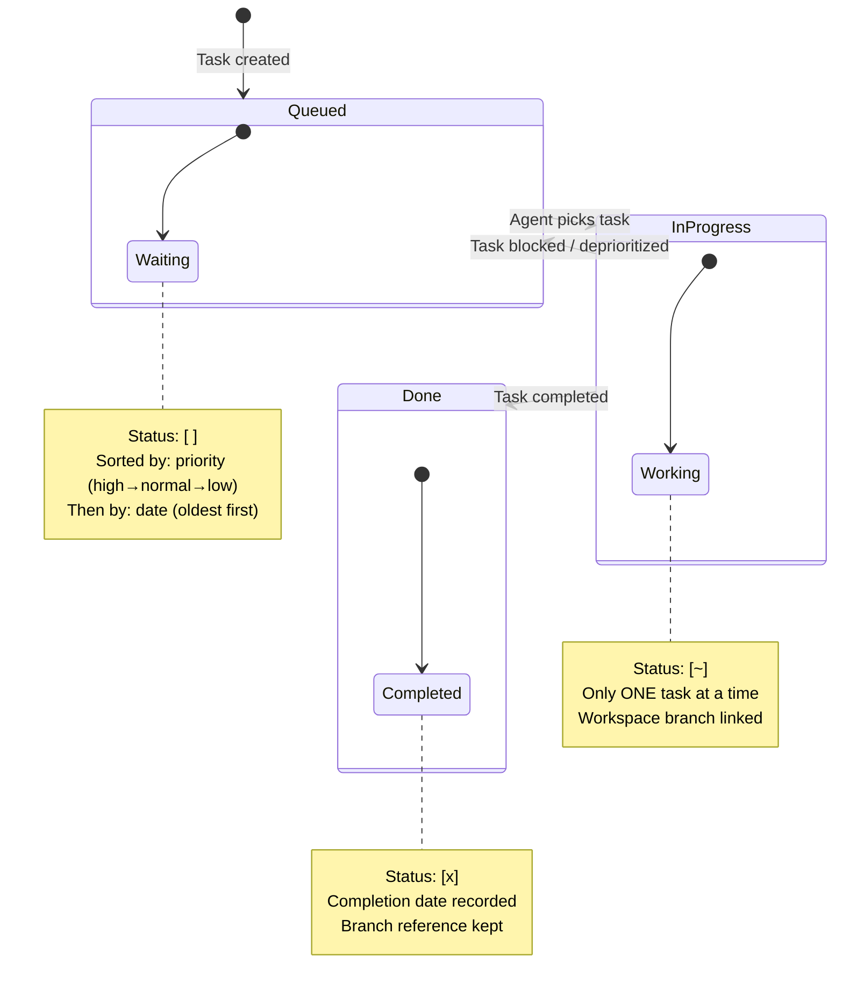

### Task Format

```
- [ ] `T-NNNN` | <priority> | <description> | source:<origin> | <date-added>
```

| Field | Values | Description |
|---|---|---|
| **Status** | `[ ]` / `[~]` / `[x]` | Queued / In Progress / Done |
| **ID** | `T-NNNN` | Auto-incrementing per agent |
| **Priority** | `high`, `normal`, `low` | Determines pick order |
| **Source** | `admin`, `self`, `<agent-name>` | Who created the task |
| **Date** | `YYYY-MM-DD` | When the task was added |

### Task Picking Algorithm

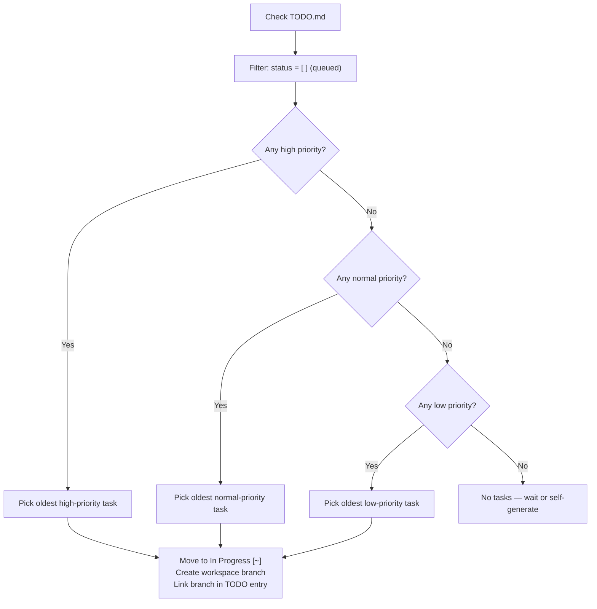

### Task Sources

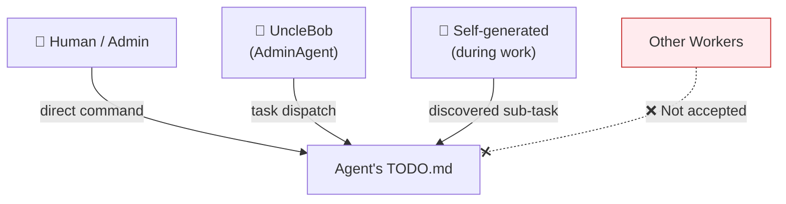

**Rule:** Workers only accept tasks from Human, AdminAgent (UncleBob), or self-generated. Tasks from other workers are not accepted.

---

## 7. Complete Task Execution Flow

End-to-end flow of how a worker agent picks up and completes a task:

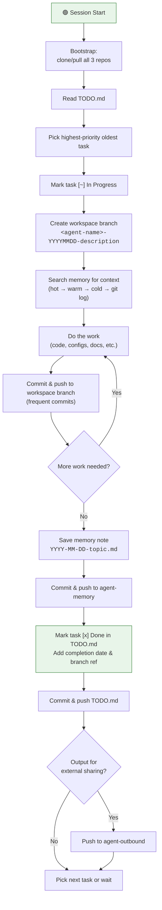

---

## 8. Data Flow Summary

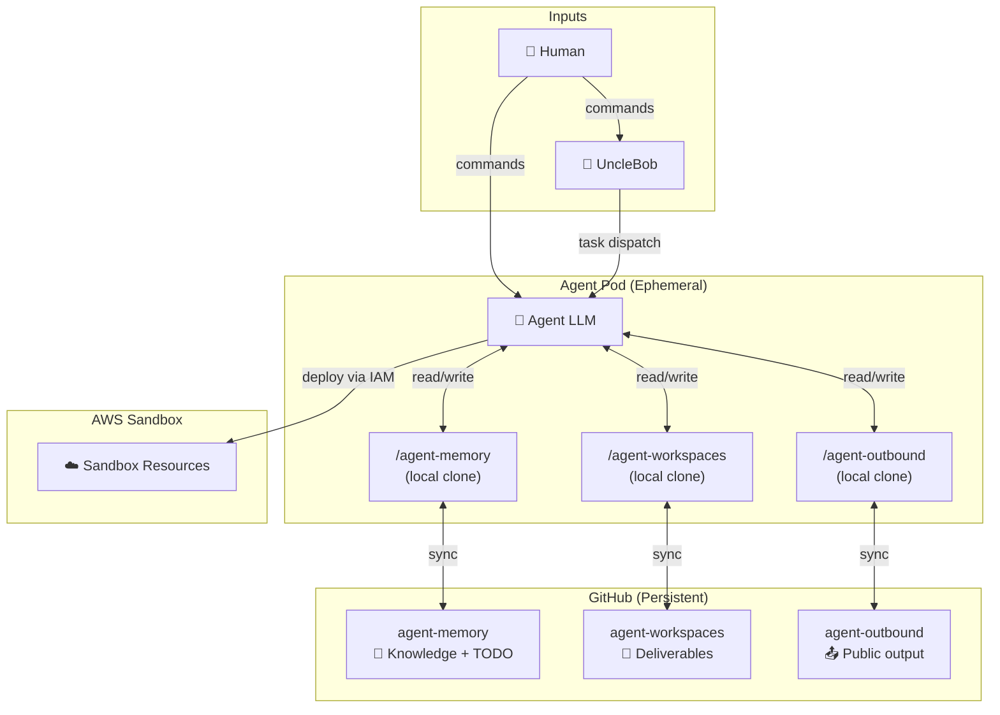

---

## Quick Reference

| What | Where | Persists? |
|---|---|---|
| Task backlog | `agent-memory/TODO.md` | ✅ Git |
| Task notes & learnings | `agent-memory/*.md` | ✅ Git (archived over time) |
| Work-in-progress code/docs | `agent-workspaces/<branch>` | ✅ Git |
| External-facing documents | `agent-outbound/main` | ✅ Git |
| Local filesystem | `/home/agent/*` | ❌ Lost on pod restart |
| Git commit history | All repos | ✅ Permanent & searchable |
